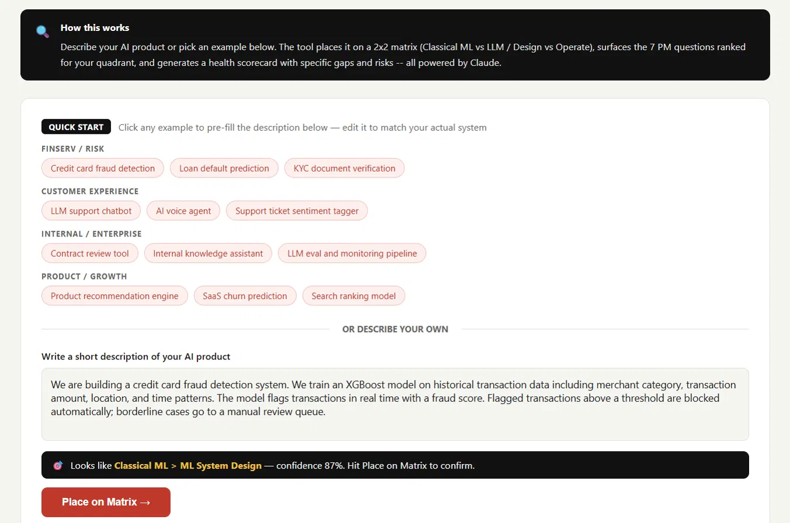
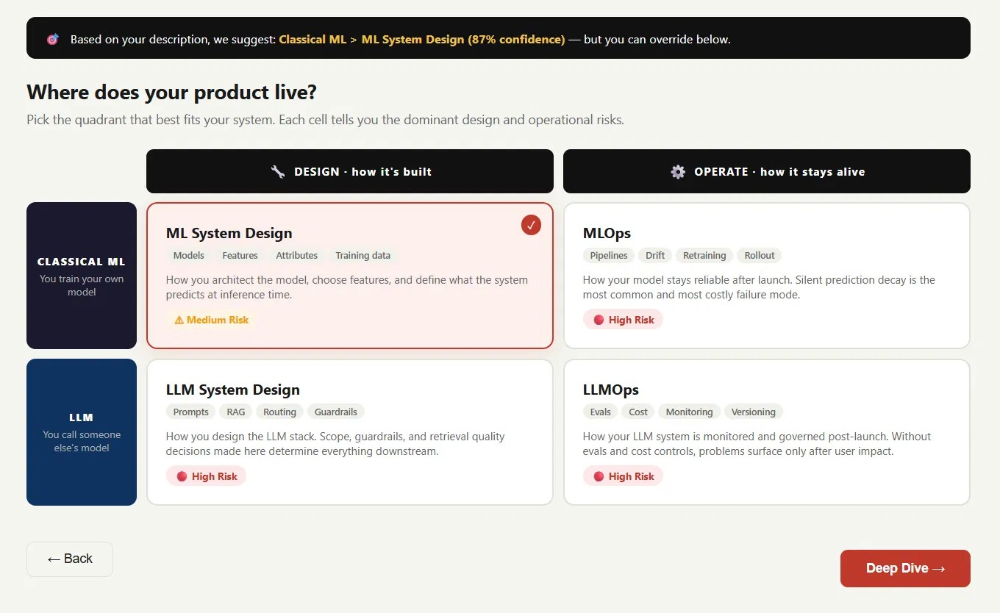
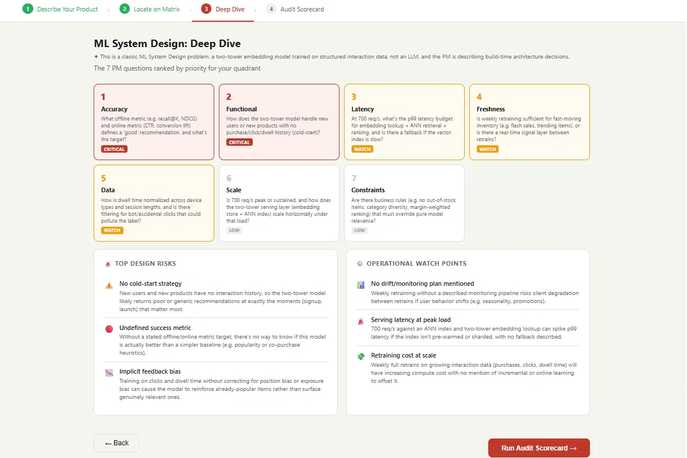
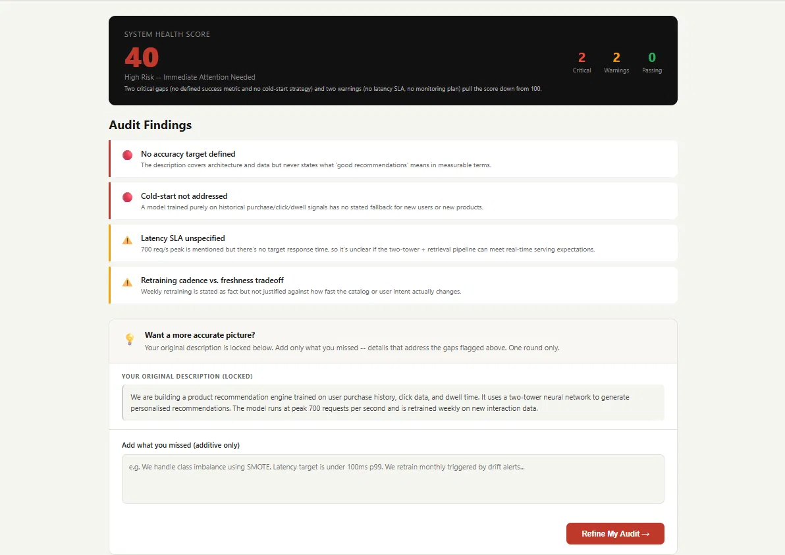

# 🔍 AI System Lens

**See your AI product clearly.**

AI System Lens is an interactive PM tool that helps you audit any AI product across a 2x2 matrix (Classical ML vs LLM / Design vs Operate), surfaces the 7 critical PM questions ranked by priority for your quadrant, and generates a Claude-powered health scorecard with specific gaps and risks.

Built as part of the [AI Solutions Portfolio](https://rishendra125.github.io) by Rishendra Vikram Singh.

---

## Live Demo

**Try it here:** [rishendra125.github.io/ai-system-lens](https://rishendra125.github.io/ai-system-lens)

You will need an Anthropic API key to enable AI-powered analysis. Your key stays in your browser session only and is never stored on any server. Get one free at [console.anthropic.com](https://console.anthropic.com).

---

## Screenshots

**Step 1 - Describe your product**

**Step 2 - Locate on the matrix**

**Step 3 - Deep Dive**

**Step 4 - Audit Scorecard**

---

## What it does

Most PMs building AI products are not sure what questions to ask before writing a single line of code. This tool helps you figure that out - fast.

You describe your AI product in plain language. The tool reads it, figures out what kind of AI system you are building, and tells you exactly where the risks are and what you have not thought through yet.

**Step 1 - Describe your product**
Tell the tool what you are building in a sentence or two. Not sure where to start? Pick from 12 ready-made examples covering fraud detection, customer chatbots, recommendation engines, document review tools, and more. The tool reads your description and immediately suggests where it fits.

**Step 2 - Locate on the matrix**
Every AI product sits somewhere on a simple 2x2 grid with two questions driving it: what kind of AI are you using, and what stage is it at?

| | **Design** (how it's built) | **Operate** (how it stays alive) |
|---|---|---|
| **Classical ML** (you train your own model) | ML System Design | MLOps |
| **LLM** (you call GPT-4, Claude, etc.) | LLM System Design | LLMOps |

A fraud detection model you trained yourself that is already in production = **MLOps**. A GPT-4 chatbot you are still designing guardrails for = **LLM System Design**. The tool suggests the right box based on your description and shows you what risks typically live there.

**Step 3 - Deep Dive**
Before shipping any AI product, there are 7 questions every PM must answer. The tool ranks them by priority for your specific product - the ones that could sink your launch come first.

| # | Question | Example for a fraud model |
|---|---|---|
| 1 | **Functional** - what goes in, what comes out? | Transaction data in, fraud score out. What happens when the model is unsure? |
| 2 | **Scale** - how many requests at peak? | Can the model score 700 transactions per second during Black Friday? |
| 3 | **Latency** - how fast must it respond? | Card authorisation times out in 200ms - can inference beat that? |
| 4 | **Freshness** - how current must the data be? | Fraud patterns change weekly - how often does the model retrain? |
| 5 | **Accuracy** - what is good enough? | What false-positive rate is acceptable before customers start complaining? |
| 6 | **Data** - where does training data come from? | Chargebacks confirm fraud weeks later - how does label lag affect training? |
| 7 | **Constraints** - what limits us? | PCI-DSS compliance, explainability for declined transactions, cost per call. |

The tool does not show these as a generic checklist. It rewrites each question for your exact product and tells you which ones are critical to answer before you ship.

**Step 4 - Audit Scorecard**
You get a health score out of 100. The score reflects how complete your thinking is - not how impressive your description sounds. Each finding tells you what you mentioned, what you left out, and why the gap matters. You get one chance to add missing detail and see the score update. One round only, by design.

---

## The design logic

**Scoring is honest.** The score reflects the completeness of your thinking, not keyword matching. Mentioning "we use SMOTE for class imbalance" closes that gap. Saying "we handle cold-start" without specifying for users vs new items keeps the finding open.

**One refinement round.** For typed descriptions, your original is locked and you can only add context. This prevents gaming the score and rewards honest first-pass thinking. The first description is the most honest signal.

**Chip vs typed paths behave differently.** If you use a quick-start chip, the example description is editable and treated as a draft. If you type your own, the original is locked for the refinement round.

---

## The framework behind it

The matrix comes from a PM framework asking two questions of every AI product: how is it built (Design) and how does it stay alive (Operate). The two product types are Classical ML (you train your own model) and LLM (you call someone else's model).

The 7 PM questions (Functional, Scale, Latency, Freshness, Accuracy, Data, Constraints) are a standard AI product design checklist. This tool ranks them by priority for your specific quadrant and product.

---

## Known Limitations

This tool is itself an LLM product, so it is fair to run it through its own framework. Auditing it honestly:

**What is working well (LLM System Design)**
- Prompt is structured and quadrant-specific
- Routing logic maps descriptions to the right context
- JSON fallback prevents the tool from breaking if the API call fails

**What is missing (LLMOps gaps)**
- No evals - there is no automated check that Claude's output quality is consistent across different descriptions
- No cost monitoring - token usage per session is not tracked
- No prompt versioning - changes to the prompt are not logged or tracked
- No failure rate visibility - how often the fallback fires is unknown

The tool would score around 50-55 if audited by itself. This is intentional - it demonstrates that even a working AI product has LLMOps gaps that most PMs do not think about until something breaks in production.

---

- Vanilla HTML, CSS, JavaScript - no framework, no build step
- Anthropic Claude Sonnet 4.6 via direct browser fetch
- User-provided API key stored in sessionStorage only
- Keyword scoring engine with confidence scoring for real-time quadrant suggestion
- Static fallback data if API call fails

---

## Running locally

No setup needed. Just open `index.html` in a browser. Enter your Anthropic API key when prompted.

---

## Portfolio context

This tool is one of several AI PM tools built to demonstrate applied AI product thinking:

- **BriefCast** - AI-powered stakeholder reporting generator
- **PropelIQ** - Commercial proposal intelligence
- **ValidIQ** - Discovery-to-ROI confidence scorer for finserv PMs
- **AI System Lens** - AI product risk and design intelligence (this tool)

Full portfolio: [rishendra125.github.io](https://rishendra125.github.io)

---

*Built by Rishendra Vikram Singh - Senior Consultant, PMP, PMI-ACP, A-CSM*
*LinkedIn: [linkedin.com/in/rishendra-vikram-singh-a7355718a](https://linkedin.com/in/rishendra-vikram-singh-a7355718a)*
